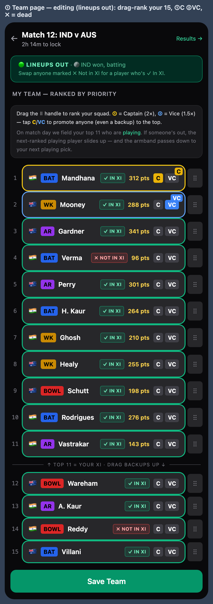
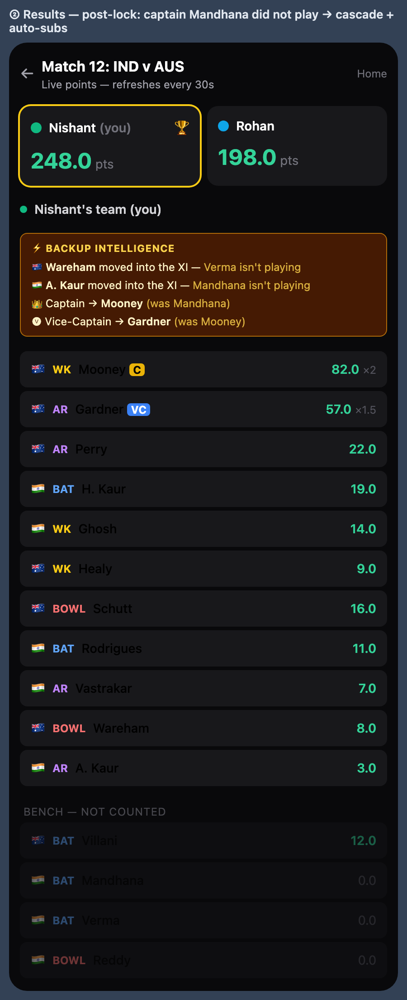
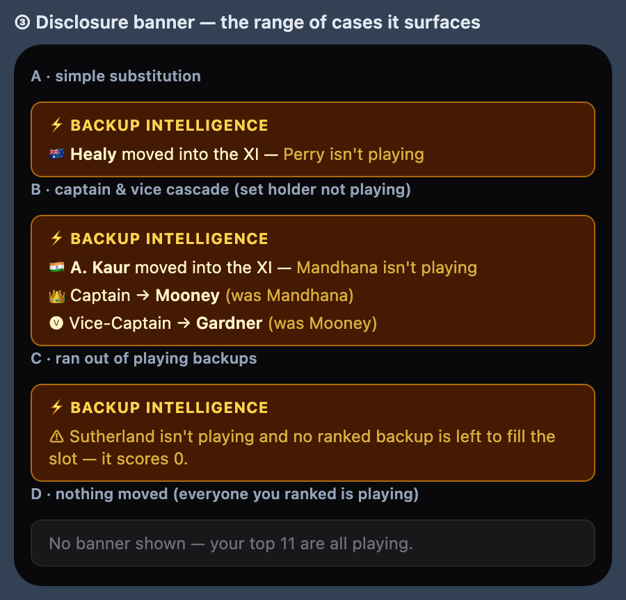

# wwc-draft

A real-time, turn-based fantasy cricket draft for two friends — with a "backup intelligence" engine that auto-substitutes benched players, cascades the captaincy down your priority ranking once official lineups drop, and then shows you exactly what it changed.

**Live demo:** https://wwc-draft.vercel.app
**Stack:** Next.js 16 (App Router, React 19) · TypeScript · Turso/libSQL + Drizzle · Tailwind CSS v4 · Vercel

> Built and maintained by [Nishant Singodia](https://github.com/nishantsingodia) — Director of Product. This is a personal 0→1 project I designed, built, and shipped end to end (auth, real-time draft, live scoring, deploy). It's a small-audience app on purpose; the interesting part is how it stays *correct* against messy live-cricket data.

---

## Screenshots

**Priority-ranked team editing** — drag to reorder; the top 11 is your XI, with In-XI / Not-in-XI markers and tap-to-set C/VC.



**Post-lock results** — the backup-intelligence cascade applied, with the scoreboard and substitution disclosure.



**Disclosure banners** — the four cases the app transparently surfaces after lineups lock.



---

## Why I built it

A friend and I wanted to draft fantasy cricket squads against each other across whatever tournament was on — but real cricket is messy: lineups change at the toss, the same surname appears twice in a squad, and the points feed numbers its matches differently than I do. Instead of nagging us to manage benched players or silently scoring zero, I wanted an app that quietly fields your next-best *playing* pick, moves the armband for you, and is honest about every change it made. Each production incident became a documented rule and an architectural fix, so the next tournament needs less babysitting than the last.

## What it does

- **Real-time live draft room** — coin-toss for pick order, strict turn enforcement, optimistic two-tap confirm, and steal detection when your opponent grabs a player mid-turn.
- **Two-player and N-player snake draft** — N=2 alternates; N>2 runs a proper snake order (round 1 forward, round 2 reversed). *(No auction mechanic — the draft is purely turn-based.)*
- **Quick Draft** — queue up to 10 picks that auto-fire on each of your turns, with steal-aware re-queuing if a queued player gets taken.
- **Backup intelligence (the headline feature)** — your squad is a single drag-to-reorder priority ranking; the top 11 is your XI, and tapping C/VC promotes any player (even a backup) to rank 1/2. Once official lineups are announced, non-playing starters drop out, lower-ranked *playing* players slide up, and the captain/vice armband cascades down the ranking — then a post-lock banner discloses every substitution and armband move.
- **Multi-tournament** — the same app handles many men's and women's tournaments at once, with a stadium-themed gold+navy design system (Tailwind v4 token layer) and a reduced-motion-safe lobby→draft slide.
- **Lobby** — Live / Upcoming / Completed tabs with running scores, C/VC comparison, and a winner trophy.
- **Approval-gated undo** — either player can request a cascading rollback of picks; it freezes picking until the opponent approves, with a TTL so an unresponsive opponent can't deadlock the draft.
- **Manual draft mode** — draft over WhatsApp and enter the teams in-app, alongside the live draft mode.
- **Live data feeds** — fantasy points stream in from a Google Sheet (one tab per tour, merged at read time) and the official playing XI comes from ESPN, with manual + auto refresh.

## How it's built

Next.js 16 App Router (React 19, TypeScript) on Vercel, with Turso/libSQL via Drizzle ORM for the draft state, `@dnd-kit` for drag-to-reorder, `jose` for JWT auth, and shadcn/ui + lucide-react on a Tailwind v4 `@theme` design system. A few decisions I'd call out:

- **Backup intelligence is one pure function** (`lib/effective-lineup.ts`) — no DB, no fetch, no clock. Callers pre-fetch the official XI and pass it in, so the substitution + armband-cascade logic is trivially testable and deterministic. The scoring XI is the top-N *playing* players by rank; the armband only moves when its holder isn't playing.
- **Identity-first player matching.** Points and XI membership join on a stable registry `pid` (cricsheet hash / `espn:N` / `slug:`), with a shared fuzzy name-matcher (`lib/fuzzy-name-match.ts`) as a fallback that returns `null` on ambiguity rather than guessing — this is what fixed same-surname mis-joins (e.g. Sunny vs Smit Patel).
- **Points match on team-pair + closest date** (within a guard window), never on the sheet's "Match N" label — deliberately immune to the points bot's divergent match numbering and team-order/format drift.
- **Explicit lineup precedence** (`lib/official-lineup.ts`): per-match XI from the sheet (pid-keyed) > live ESPN announced XI > last-played XI fallback.
- **Self-healing roster.** Any player who shows up in the live feed but isn't in the seed JSON is merged into the draft pool on the fly as a synthetic player, so they're draftable and resolve everywhere.
- **Undo is an atomic libSQL `batch()`** — delete picks ≥ the target, clear stale selections, reset the pick count — gated behind an approval handshake with a TTL.
- **C/VC multipliers (C 2×, VC 1.5×) are applied exactly once**, with `rawPoints` and `fantasyPoints` kept distinct, after a production double-multiply bug. That and other incidents are written up in [`BUGS.md`](BUGS.md); the operational runbook for adding a tour is in [`CLAUDE.md`](CLAUDE.md).

## Run it locally

```bash
git clone https://github.com/nishantsingodia/wwc-draft.git
cd wwc-draft
npm install

# create .env.local with at least:
#   TURSO_DATABASE_URL=...        # or a local libSQL/sqlite file
#   TURSO_AUTH_TOKEN=...
#   JWT_SECRET=...                # set this — there is an insecure hardcoded fallback
#   POINTS_CSV_URLS=...           # comma-separated Google Sheet gviz tab URLs (with &headers=1)

npm run migrate     # apply the schema (scripts/migrate.ts)
npm run dev         # http://localhost:3000
```

Access is intentionally hardcoded to two user codes (`lib/users.ts`) — this is a personal app, not a multi-tenant or sign-up product.

## Honest limitations

This is a personal-scale app, and the README shouldn't pretend otherwise:

- **Two hardcoded users**, names and colors baked in (`lib/users.ts`); no sign-up, not multi-tenant.
- **No auction** despite the genre's connotations — it's purely turn-based.
- **`JWT_SECRET` falls back to a hardcoded default** if the env var is unset — fine for a two-person app, not for any real deployment.
- **Correctness depends on external feeds staying in sync.** The points bot's `tours.json` `espn_series` must match `lib/espn.ts` `SERIES_BY_GENDER` by hand, or "Lineups Out" silently falls back. Adding a tour is several manual, easy-to-miss steps ([`BUGS.md`](BUGS.md) documents past silent-0-points incidents); each new tournament needs a hand-researched expected-XI seed.
- **Real-time is client polling** (2s/5s), not websockets/SSE.
- **Single-region, serverless DB** — draft state lives in one Turso/libSQL database; there's no multi-region replication or backup story beyond Turso's own.

---

Built by **Nishant Singodia** · [GitHub](https://github.com/nishantsingodia) · [LinkedIn](https://linkedin.com/in/nishantsingodia) · nishantsingodia@gmail.com
